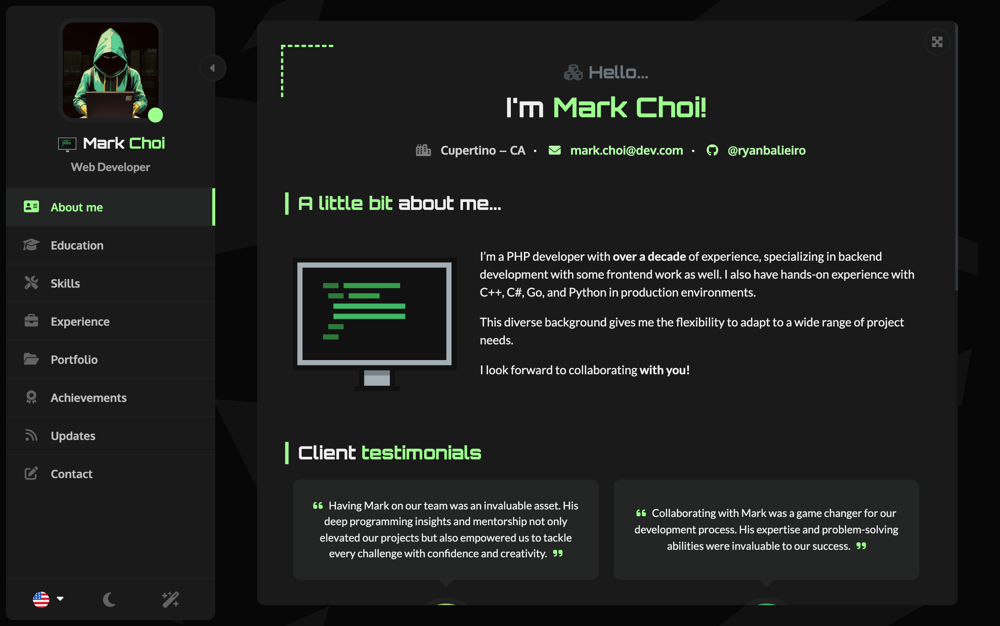
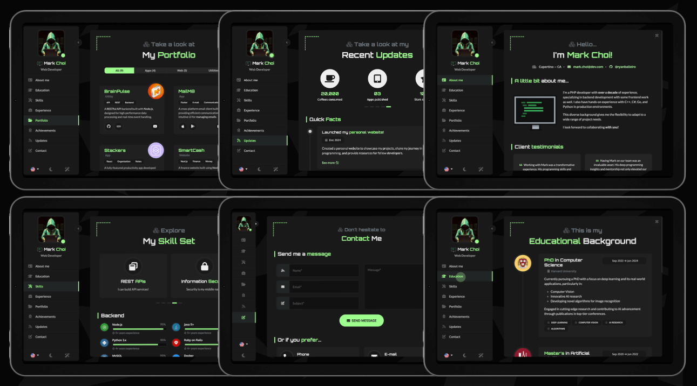
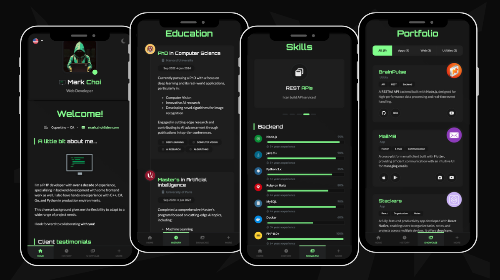

# [ React Portfolio](https://ryanbalieiro.github.io/react-portfolio-template/) by Muhammed Gardashov

A sleek, futuristic portfolio template for developers – built with **React** and **Bootstrap 5**.

Key features:
- Lightweight and fully responsive.
- Adapts perfectly to mobile screens.
- Multi-language support included.
- Comes with both dark and light theme options.
- A variety of components to highlight your work experience, education, skills, portfolio, and more.
- Uses **Vite** for packaging.
- Emails with **EmailJS** - no backend needed!

## [Live Preview](https://ryanbalieiro.github.io/react-portfolio-template/)

Check out the live version of the template deployed **[here on GitHub Pages](https://ryanbalieiro.github.io/react-portfolio-template/)**.

### 1. Base layout
The layout uses a fixed central view with a left sidebar, adjusting perfectly across various monitor resolutions, from 4:3 to ultra-wide.

### 2. Desktop Screenshots
The main view transitions smoothly when a new page is selected from the sidebar, giving a page-flipping effect. The sidebar is also toggleable, allowing the content area to expand for a larger viewing space.

### 3. Mobile Screenshots
On mobile, the layout groups the portfolio sections into categories and transforms into a tabbed interface with a bottom navigation.

